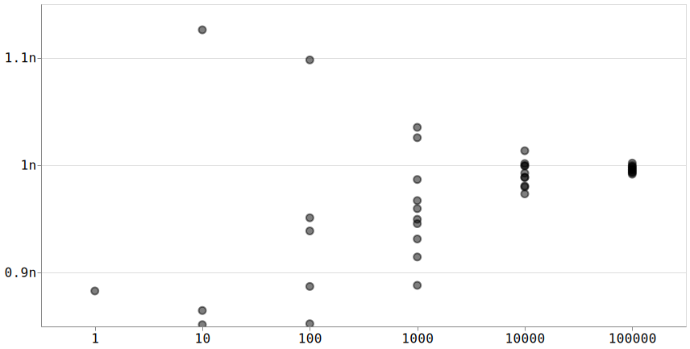

+++
title = "Implementing CVM For Fun and Fun"
date = 2024-05-28
description = "An educational sketch"

[extra]
hidden = true
+++

There's been a new Knuth paper about a distinct-values sketch floating around my corner of the internet. Despite having not interacted with a sketch professionally in quite a long time, sketches are still [near and dear to my heart][pwl_hll] and this felt like a fun opportunity to implement something new.

For the unfamiliar, probabilistic sketching is cheating at data structures by using statistics. In return for accepting some amount of error, and usually a bounded amount, you get to break the fundamental laws of computer science. A [Bloom filter][bloom_filter] is the most famous example, but sketches like HyperLogLog and CountMinSketch have been showing up in industry with some regularity.

The sketch in Knuth's note is a sketch that, like [HyperLogLog][hll_paper], gives an estimator for the distinct element problem, aka the "how big is my set" problem. The new algorithm is interesting in that it doesn't solve the problem with tighter bounds or while using less space or offer any improvement over HLLs and other state-of-the-art sketches. It's intended as a teaching tool and is an algorithm that students can implement and can write coherent proofs about without the [graduate level math skills][mellin] that are table stakes for proving meaningful bounds on other sketches.

[bloom_filter]: https://en.wikipedia.org/wiki/Bloom_filter
[pwl_hll]: https://www.youtube.com/watch?v=y3fTaxA8PkU
[hll_paper]: https://dmtcs.episciences.org/3545/pdf
[mellin]: https://mathworld.wolfram.com/MellinTransform.html

---

What Knuth calls CVM was originally proposed by [Sourav Chakraborty, N. V. Vinodchandran, and Kuldeep S. Meel][cvm_arxiv] in a paper that explicitly targets teaching. The original paper doesn't even focus on implementation and data structures. It aims itself directly at students looking to write proofs about the algorithm. The paper works through three versions of this algorithm and spends most of its time on proofs of the error bounds of each iteration, building on the proofs from previous iterations to prove things about the next.

All three versions of the algorithm work by keeping a set of elements seen in the stream until it hits some predetermined size. At that point, the algorithm discards elements of the set with some probability to keep the set below that size. The first iteration of the algorithm discards every element with probability 1/2 and terminates if the set is ever empty. The second iteration simply removes the termination condition. The third and final iteration introduces randomness and uses it to keep the set of observed elements below the size threshold.

[cvm_arxiv]: https://arxiv.org/abs/2301.10191

On its own, Chakraborty et. al feels unapproachable to anyone who is not a student of probability theory - it's _very_ focused on the math. As someone who's been away from that kind of math for more than a decade, I absolutely can't follow the proofs here. Implementation and data structures appear to be an afterthought - the third iteration of the algorithm depends on keeping around an infinitely growing string of random bits.

---

[Along comes Donald Knuth][cvm_note], with a celebration of this algorithm.

Knuth makes the whole thing much more approachable to the lay programmer. Knuth starts at the end with what he alternately calls Algorithm D and CVM (named after the three original authors), and focuses on the algorithm and intuitive proof that it works before diving in. Knuth, always himself, also spends plenty of time on the data structures required to make CVM fast and efficient.

After laying out the algorithm he dives into proofs as well, building back up from simpler algorithms to proofs on the bounds of Algorithm D. Interestingly, Knuth seems to believe that it's possible to prove tighter bounds on Algorithm D.

> To conclude this study, I had hoped to use Theorem D to sharpen the results of Corollary T, because the actual performance of Algorithm D in practice is noticeably better than the comparatively weak theoretical guarantees that are derivable from the coarser Algorithm D. Algorithm D is quite simple, so I believed that I’d be able to analyze its behavior without great difficulty. Alas, after several weeks of trying, I must confess that I’ve failed to get much further. Indeed, I think Algorithm D may well be the simplest algorithm that lies beyond my current ability to carry out a sharp
analysis!

Watch out, undergraduates.

[cvm_note]: https://www-cs-faculty.stanford.edu/~knuth/papers/cvm-note.pdf

---

At an extremely high level, Knuth's CVM works by keeping a set of elements seen so far paired with a randomly sampled value he dubs a "volatility". Each (non-distinct) element in the stream is assigned a volatility and is sampled if it has a lower volatility than any other element sampled so far and when a new element is sampled the algorithm evicts the element paired with the highest volatility. Whether or not the new element is sampled CVM updates a probability parameter `p`. At any point in time, the size of the sampled set divided by `p` is an unbiased estimator of the number of unique elements in the stream.

The high-level explanation glosses over important details in the algorithm that handle edge cases and correct for sampling bias, but  I found that an actual implementation is as readable and concise as the pseudocode Knuth presents for Algorithm D.

```rust
struct Cvm {
    size: usize,
    p: f32,
    buf: Treap,
}

impl Cvm {
    pub fn new(size: usize) -> Self {
        // D1 - p=1, buf is empty
        Self {
            size,
            p: 1.0,
            buf: Treap::new(),
        }
    }

    pub fn insert(&mut self, key: u32) {
        let u: f32 = rand::thread_rng().gen();

        // D4 - if B contains the pair (a, u) delete it
        self.buf.remove(&key);

        // D5 - if u >= p, bail. if there's room in the
        // buffer, either because the buffer is still growing
        // to its max or the same key just got removed,
        // insert the new node.
        if self.p <= u {
            return;
        }

        if self.buf.len() < self.size {
            self.buf.insert(key, u);
            return;
        }

        // D6 - based on the value of u, either swap the new
        // node into the buffer or update the value of p.
        let (key_max, u_max) = self.buf.last().unwrap();
        if u_max < u {
            self.p = u
        } else {
            self.buf.remove(&key_max);
            self.buf.insert(key, u);
        }
    }

    pub fn estimate(&self) -> f32 {
        // at any point, D2 is a valid estimate
        self.buf.len() as f32 / self.p
    }
}
```

The only step in Knuth's algorithm D that it doesn't make sense to represent explicitly in code is Step D3 - sampling the next element from a stream. In practice, you'll be doing that by processing an incoming stream of data from some external source.

---

Knuth's implementation of the algorithm is [available as a literate program][cvm_cweb] alongside his note. If you're [feeling adventurous][texlive], you can turn it into a stripped C file or a [rendered PDF][cvm_rendered].

I found Knuth's implementation difficult to follow. It freely mixes the CVM implementation with the guts of a hash-table implementation and with all of the code for building and searching a treap. None of those details really matter for the correctness of the CVM algorithm itself and almost all of the complexity seems to come from the hash table and treap code.

I spent a while staring at the treap implementation before deciding to ignore it entirely. While the treap is extremely important to the implementation of the algorithm if you'd like it to be fast (and a very cool data structure) it has nothing to do with whether or not the implementation correct.

It turns out it's fairly easy to fake a treap with a sorted array:

```rust
#[derive(Debug)]
struct Treap {
    data: Vec<Node>,
}

#[derive(Debug, Clone, Copy)]
struct Node {
    key: u32,
    vol: f32,
}

impl Treap {
    fn new() -> Self {
        Self { data: Vec::new() }
    }

    fn len(&self) -> usize {
        self.data.len()
    }

   fn insert(&mut self, k: u32, v: f32) {
        self.remove(&k);

        let idx = self.data.partition_point(|e| e.vol < v);
        self.data.insert(idx, Node { key: k, vol: v });
    }

    fn remove(&mut self, k: &u32) {
        let mut i = 0;
        while i < self.data.len() {
            if &self.data[i].key == k {
                self.data.remove(i);
            } else {
                i += 1;
            }
        }
    }

    fn last(&self) -> Option<(u32, f32)> {
        self.data.last().map(|n| (n.key, n.vol))
    }
}
```

It's certainly not the prettiest or fastest thing in the world, but it lets us go test out CVM on some real data.

[texlive]: https://tug.org/texlive/
[cvm_cweb]: https://cs.stanford.edu/~knuth/programs/cvm-estimates.w
[cvm_rendered]: cvm-estimates.pdf

---

To test, I ran my implementation against a stream of random numbers generated by the [`rand` crate][rand]'s default RNG and compared against a `HashSet` of the actual values. These tests generated elements until the HashSet hit 1,000,000 unique elements.

After 10 trials at each buffer size, my toy implementation appears to the naked eyeball to be close enough to Knuth's results for `Stream A1` - random data - that I'm happy to call this a working implementation.



Eyeballing this is as far as I went with analysis because the bounds that Knuth and the original authors prove are hard to comprehend, let alone to do napkin math about. I wouldn't believe most practicing software engineers if they told me they could intuit how a change in CVM buffer size (Knuth's `s`) changes the error. Compare that to an algorithm like HyperLogLog and its error bound of `1.04/sqrt(m)`.

It really is quite astonishing that this is a good estimator. Given how simple the code is, and Knuth's ringing endorsement, I wouldn't be the least bit surprised if it makes it into more than a few CS textbooks.

[rand]: https://crates.io/crates/rand
